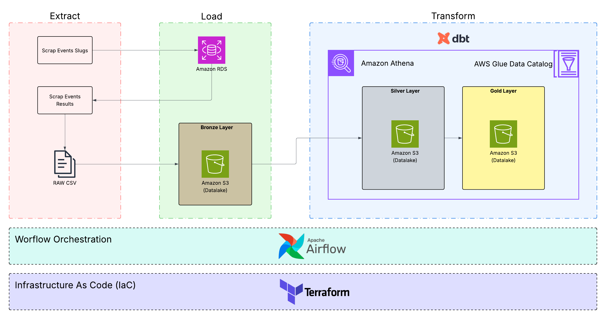

# Brazilian Running Results Pipeline

Pipeline de dados para corridas de rua no Brasil, cobrindo ingestao, persistencia,
exportacao para data lake e transformacao analitica.

## Visao geral

<p align="center">
  
</p>

O projeto possui quatro blocos principais:

1. `spider/`: extracao e processamento de dados do OpenResults para PostgreSQL + S3.
2. `infra/`: provisionamento AWS via Terraform (rede, RDS, S3, Glue Data Catalog).
3. `dbt/running_results/`: modelagem medalhao em Athena (staging, intermediate, marts).
4. `orchestration/`: reservado para orquestracao (ex.: Airflow).

Fluxo macro:

1. Coleta eventos no OpenResults.
2. Persiste dimensoes e fila de tarefas no PostgreSQL.
3. Extrai resultados por modalidade/genero e grava CSV particionado em S3.
4. Exporta dimensoes em Parquet para S3.
5. Registra particoes no Glue e converte resultados em `dim_results` no Athena.
6. Executa dbt para gerar camada analitica final.

## Arquitetura (alto nivel)

```text
OpenResults API/HTML
        |
        v
Spider (Python)
  - task_extract_and_store_names
  - task_scrape_and_store_results
  - task_export_dimensions
        |
        +--> PostgreSQL (estado operacional: eventos, modalidades, jobs, tasks)
        |
        +--> S3 (results/*.csv e dims/*.parquet)
                    |
                    v
              Glue/Athena (tabelas externas)
                    |
                    v
                 dbt (silver/gold)
```

## Estrutura do repositorio

```text
README.md
infra/
  glue.tf
  main.tf
  modules/
  scripts/
spider/
  main.py
  task_extract_and_store_names.py
  task_scrape_and_store_results.py
  task_export_dimensions.py
  config/config.yml
  src/
    database/
    extractors/
    parses/
    storage/
  test/
dbt/
  running_results/
    dbt_project.yml
    profiles.example.yml
    models/
```

## Pre-requisitos

- Python 3.14+
- PostgreSQL acessivel
- AWS CLI configurado com perfil valido
- Terraform >= 1.0
- dbt Core + adapter Athena
- `uv` (recomendado para ambiente Python)

## Quickstart local

### 1) Preparar ambiente do spider

```bash
cd spider
python -m venv .venv
source .venv/bin/activate
pip install --upgrade pip
pip install uv
uv sync
```

### 2) Configurar variaveis de ambiente

Crie um arquivo `.env` em `spider/`:

```env
DB_HOST=localhost
DB_PORT=5432
DB_NAME=running_results
DB_USER=postgres
DB_PASSWORD=postgres
DB_CONNECT_TIMEOUT=15
```

### 3) Executar migracao do banco

```bash
cd spider
source .venv/bin/activate
uv run -m src.database.migrations.run_migration
```

Opcional: reset total (destrutivo):

```bash
uv run -m src.database.migrations.run_migration --hard-reset
```

### 4) Rodar pipeline local fim-a-fim

```bash
uv run python main.py
```

Esse comando executa em sequencia:

1. `extract_and_store_names`
2. `scrape_and_store_results`

Para exportar dimensoes para S3:

```bash
uv run python task_export_dimensions.py
```

## Execucao por tarefas

Em `spider/`:

```bash
uv run python task_extract_and_store_names.py
uv run python task_scrape_and_store_results.py
uv run python task_export_dimensions.py
```

## Configuracao principal do pipeline

Arquivo: `spider/config/config.yml`

Secoes mais importantes:

- `pipeline`: modo de extracao de eventos (`paged` ou `full`), paginas e batch.
- `result_pipeline`: concorrencia, tamanho de lote e limite de tentativas.
- `s3`: bucket, regiao, prefixos e profile AWS.
- `extact_event_name` e `extact_event_result`: delay, timeout e user-agent.

Observacao: as chaves no YAML estao nomeadas como `extact_*` no codigo atual.

## Modelo operacional no PostgreSQL

Criado por `spider/src/database/migrations/migration.sql`:

- Dimensoes operacionais: `state`, `city`, `date`, `event`, `modality`, `category`.
- Fato operacional: `result`.
- Controle de processamento: `extraction_job`, `extraction_task`.

Pontos de qualidade:

- Dedupe de evento por `hash_slug` (MD5 do slug).
- Dedupe de modalidade por `(event_id, raw_category_name)`.
- Dedupe de resultado por `(modality_id, category_id, bib_number)`.

## Data Lake + Athena

O pipeline grava:

- Resultados brutos em CSV sob `s3://<bucket>/results/...` (particionado por estado/cidade/modalidade/pcd/genero/evento).
- Dimensoes em Parquet sob `s3://<bucket>/dims/<dimension>/data.parquet`.

Scripts uteis em `infra/scripts/`:

- `register_new_partitions.py`: registra apenas novas particoes em `results_csv`.
- `csv_to_parquet.py`: carrega incrementalmente CSV para `dim_results` no Athena.

Exemplos:

```bash
python infra/scripts/register_new_partitions.py --dry-run
python infra/scripts/register_new_partitions.py --batch-size 100

python infra/scripts/csv_to_parquet.py
python infra/scripts/csv_to_parquet.py --full-refresh
```

## dbt (camada analitica)

No diretorio `dbt/running_results`:

```bash
DBT_PROFILES_DIR=.. ../../.venv/bin/dbt debug
DBT_PROFILES_DIR=.. ../../.venv/bin/dbt run
DBT_PROFILES_DIR=.. ../../.venv/bin/dbt test
```

Camadas de modelos:

1. `staging`: padronizacao inicial dos dados de origem (`dim_*`).
2. `intermediate`: normalizacoes e regras de negocio.
3. `marts`: visao analitica final (`fact_results`).

## Infraestrutura (Terraform)

Resumo dos recursos principais:

- VPC/rede e regras de seguranca para RDS.
- RDS PostgreSQL para armazenamento operacional.
- S3 versionado e criptografado para resultados e dimensoes.
- Glue Data Catalog com tabelas externas para Athena.

Arquivo de exemplo de variaveis:

`infra/terraform.tfvars.example`

Comandos basicos:

```bash
cd infra
terraform init
terraform plan -var-file=terraform.tfvars
terraform apply -var-file=terraform.tfvars
```

## Testes

Em `spider/`:

```bash
uv run pytest -q
```

Existem testes de parser e conexao com PostgreSQL.

## Observabilidade e logs

- Logs do spider em `spider/logs/app.log`.
- Configuracao em `spider/config/logger_config.py` e `spider/config/config.yml`.

## Troubleshooting

### Falha de conexao com PostgreSQL

Verifique `DB_HOST`, `DB_PORT`, `DB_NAME`, `DB_USER`, `DB_PASSWORD` e `DB_CONNECT_TIMEOUT`.

### Pipeline de resultados nao sobe arquivos no S3

Verifique em `spider/config/config.yml`:

- `s3.bucket`
- `s3.region`
- `s3.profile_name`

Tambem confirme credenciais AWS com permissao de `s3:PutObject`.

### dbt nao encontra profile

Garanta `DBT_PROFILES_DIR=..` e arquivo `dbt/profiles.yml` valido.

### Athena com dados desatualizados

Execute registro incremental de particoes antes da carga:

```bash
python infra/scripts/register_new_partitions.py
python infra/scripts/csv_to_parquet.py
```

## Documentacao complementar

- `spider/README.md`: detalhes de desenvolvimento e operacao do spider.
- `infra/README.md`: guia de provisionamento e recursos Terraform.
- `dbt/running_results/README.md`: setup e operacao do projeto dbt.
- `docs/OPERATIONS.md`: runbook de operacao e resposta a incidentes.
- `docs/DATA_CONTRACT.md`: contrato de dados entre ingestao, lake e dbt.
